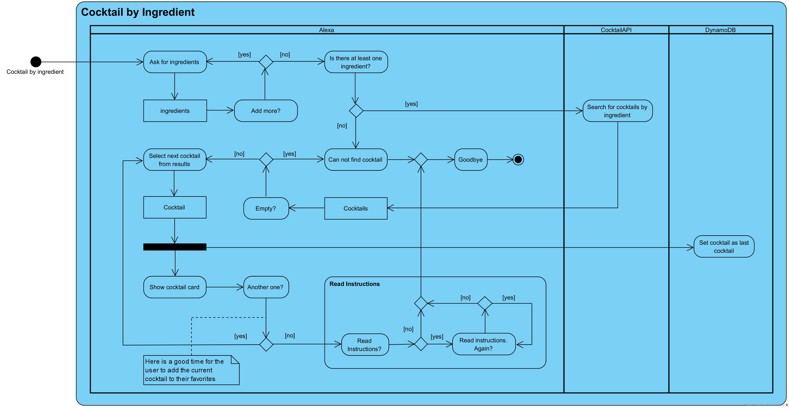
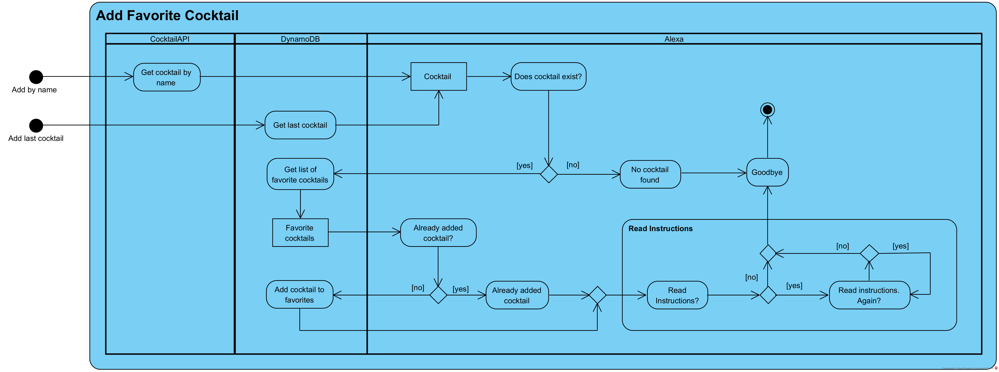
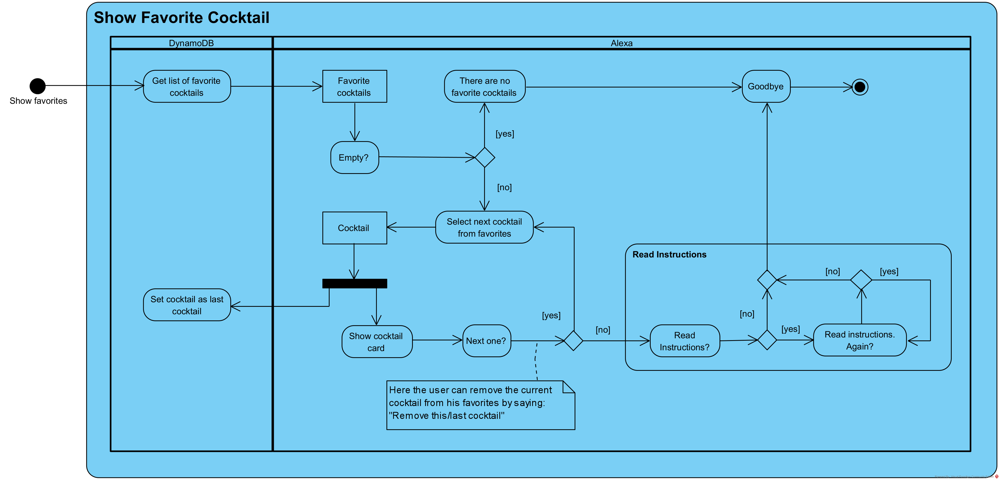
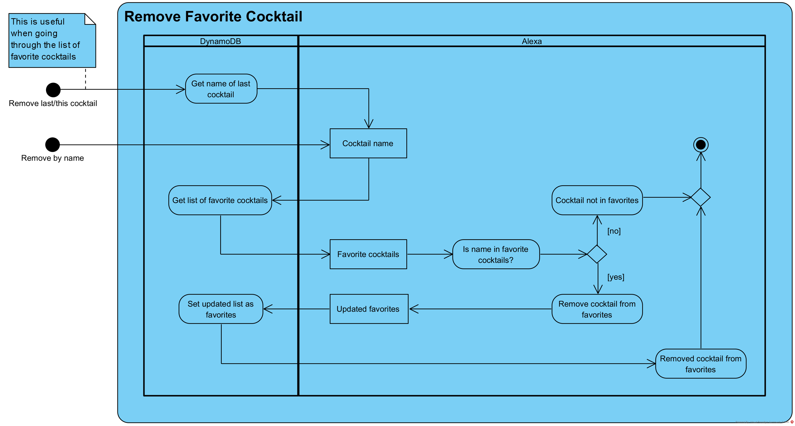

# My Barkeeper

My Barkeeper is a comprehensive cocktail management system that allows users to discover, create, and manage cocktails. The system is composed of three main components:

1. **Alexa Skill**: This component is responsible for handling user interactions through Alexa. It includes functionality for adding cocktails to favorites, searching for cocktails by name, and providing cocktail suggestions. The code for this component is primarily written in JavaScript.

2. **Backend**: This component is responsible for handling requests and serving data to the Alexa Skill. It includes functionality for retrieving random cocktails, getting all ingredients, and searching for cocktails by ingredient or name. The code for this component is primarily written in PHP.

3. **Web Crawler**: This component is responsible for retrieving cocktail data from external sources. It includes functionality for retrieving alcoholic and non-alcoholic cocktails, categories, glasses, and ingredients. The code for this component is primarily written in Kotlin.

## Some Interaction Diagrams

